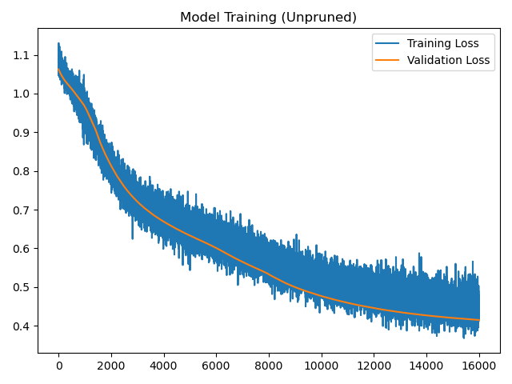
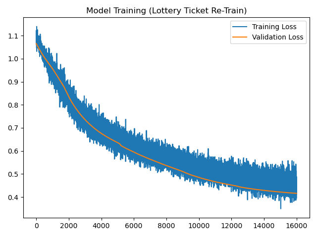
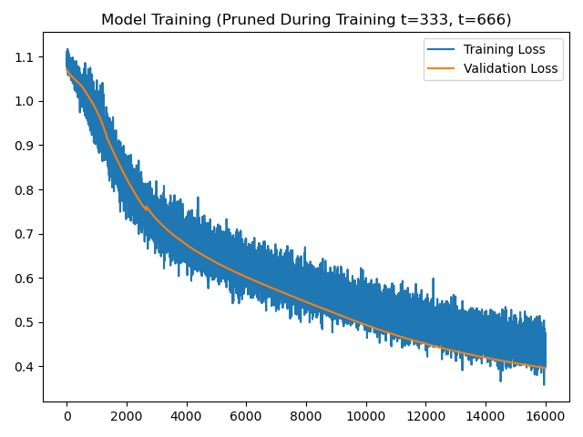
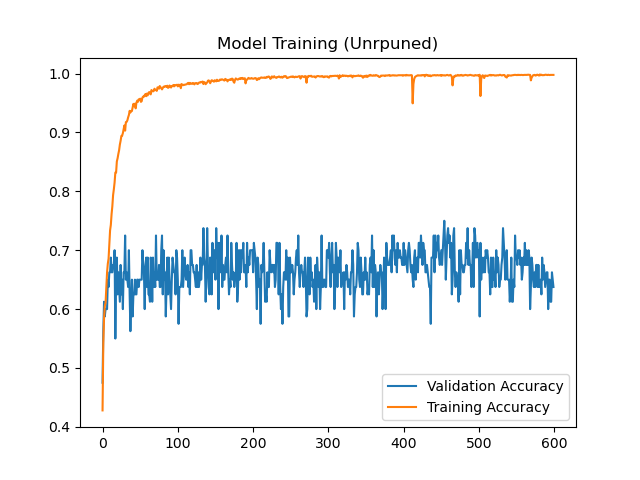
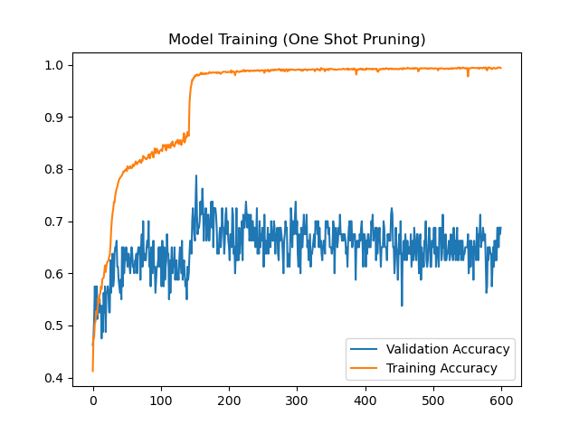
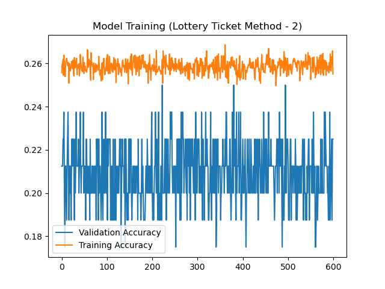
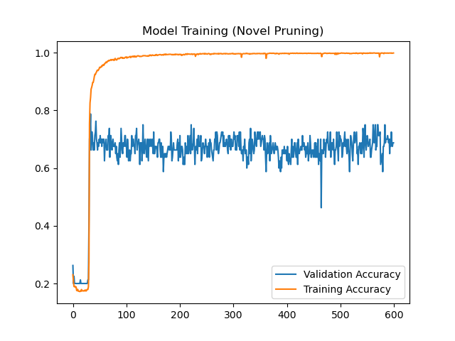
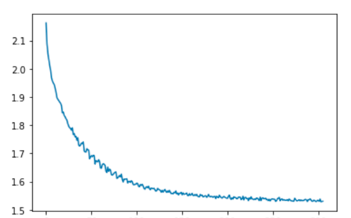
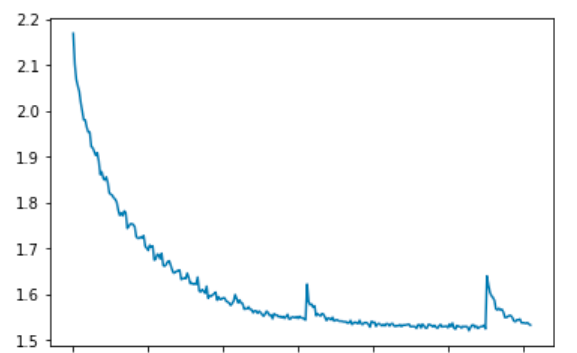

# TODO
* This is just a rough draft and needs to be revised at some point!
* Most of the intro is lifted from the proposal, and it may need to be reworked
* Add your models! the penguins are lonely :(
* Might need to come up with a better name
# Dynamic Pruning
Our class project, Dynamic Pruning, is about designing and testing a new pruning method designed to both speed up training and improve model performance.
## Introduction
Overparameterized neural networks are computationally expensive to train and use. One way to solve this problem is to prune a trained neural net by deleting specific weights. Pruning in this way decreases the parameter count of the neural net, which decreases the required storage space and the computational resources required to make predictions. However, this method requires that the neural net be trained while fully connected [4]. 

A recent paper, “Lottery Ticket Hypothesis,” [1] introduced a methodology to find the “winning ticket” in a fully-connected network, which is a subnetwork with ~90% fewer parameters and similar or in some cases higher accuracy than the original network. The methodology used by [1] is an iterative pruning technique where after training the network p% of the weights with a value below a threshold are removed, after the pruning process the weights are reset to their initial value and the process is again repeated. These winning tickets are faster to train than their fully-connected counterparts, but because the process of creating the winning tickets requires training the neural net many times it does not actually result in a faster overall training time.

We propose a pruning method where instead of resetting the weights to their initial value after pruning we carry on the training with the trained parameter values. We hypothesize that this method will tend to take lesser epochs to converge and reduce overall training time while creating a smaller network.
## Implementation
For this project, we are using the Pytorch library to create, train, prune, and evaluate models. We also use the matplotlib library to automatically generate graphs.
## Testing
In order to test our pruning method, we have implemented our pruning method on models designed for four different datasets. We also implemented other pruning methods on these same models, so as to compare our method to existing pruning methods. The datasets we used are:
* The [Penguin Dataset](https://allisonhorst.github.io/palmerpenguins/), a dataset containing body measurements for over 300 different penguins labeled by species
* The [Flower Dataest](https://dataverse.harvard.edu/dataset.xhtml?persistentId=doi:10.7910/DVN/1ECTVN), a dataset cantaining for over 3670 images of flowers of different species. 
# Penguins
The Penguin Dataset is a dataset containing body measurements of penguins and is labeled by species. The problem to be solved with a neural net is to classify a penguin's species given:
* The island from which the penguin was found
* The bill length of the penguin, in mm
* The bill depth of the penguin, in mm
* The penguin's fipper length in mm
* The penguin's mass in g
* The penguin's sex
* The year in which the penguin was recorded

The penguin's species could be one of:
* Adelie
* Gentoo
* Chinstrap
## Data Preprocessing
In order to facilitate training, the data was lightly preprocessed. The labels and classification data dimensions (island, sex, and year) were converted into one-hot vectors, and the other data dimensions were normalized by a constant value to ensure they were in a 0-1 range. Finally, we ignored any entries which had a value of NA for any field.

After preprocessing, the data was of the format:
```
0,1,0|0,1,0,1.022,0.825,1.125,1.05,1,0,0,0,1
1,0,0|0,0,1,0.7120000000000001,0.875,0.955,0.635,0,1,0,0,1
1,0,0|0,0,1,0.8220000000000001,0.905,1.025,0.86,1,0,0,1,0
```
This data was saved in the [Processed Penguins](./penguins_processed.txt) file. The first 200 entries in this file was the training data, the next 100 were the validation set, and the remaining 33 were the test set.
## Model Design
The model used for this dataset was a simple feed-forward neural net with two layers. The first layer was a Linear layer with 12 inputs and 12 outputs, and ReLU activation. The second layer was a Linear layer with 12 inputs and 3 outputs, and Tanh activation. We chose cross-entropy loss as this model's loss function, and Adam as this model's optimizer. The model was defined in Pytorch as:
```python
class PenguinModel(nn.Module):
    def __init__(self):
        super(PenguinModel, self).__init__()
        self.relu = nn.ReLU()
        self.tanh = nn.Tanh()
        self.stack1 = nn.Linear(12, 12)
        self.stack2 = nn.Linear(12, 3)

    def forward(self, x):
        return self.tanh(self.stack2(self.relu(self.stack1(x))))
```
## Trials
We put this model through four different trials in order to test our pruning method. Each time the model was trained, it was trained for 4,000 epochs with a training rate of 0.0001.
### Unpruned Model
First, we trained and tested this model without any pruning at all. On the test data, the model performed with a loss of 0.4699.



(Note that there were 4 batches per epoch, and performance during training was recorded per epoch - 4 units on the x-axis of these graphs corresponds to 1 epoch of training.)
### Pruned Model
Next, we tested the model after pruning the 30% lowest weights from the model. After pruning, the model performed on the test data with a loss of 0.4812.

This trial is defined by training a model normally and then pruning the fully-trained model. Because the training part is untouched, we reused the model trained from the first trial.
### Lottery Ticket
Third, we tested the performance of the model using the Lottery Ticket method, by resetting the weights and biases of the model to its original initialization without resetting the pruning. The model performed with a loss of 0.4672 on the test data.


### Dynamic Pruning Model
Finally, we reset the model in order to test our pruning method. For this model, we pruned the 17% lowest weights from the model 1/3rd and 2/3rds of the way through training, for a total of just over 30% of the weights removed. The model performed with a loss of 0.4289 on the test data.


## Running The Code
In order to run all of these tests at once, simply run [penguin_all.py](./penguin_all.py). It requires Pytorch and MatplotLib, and assumes that the computer running it has a GPU. Note that the program will create a file, ``penguin_checkpoint.pt`` within its working directory.

If your device does not have a GPU, or if you don't want to use your GPU, change line 8,
```python
device = "cuda"
```
to:
```python
device = "cpu"
```
## Penguin Conclusions
Using the unpruned model performance as a baseline, we can note improved performance from both the lottery ticket method and our dynamic pruning method. The model produced by normal pruning seemed to perform slightly worse than the baseline.

Due to time and resource constraints, the models could not be trained until perfect convergence. However, the unpruned and lottery ticket models seem to have very nearly converged by the end of the 4,000 epochs. However, the model trained with dynamic pruning seems to have not converged within 4,000 epochs, which suggests that dynamic pruning improves a model's capability to learn.
# Fashion MNIST

## Model Metrics Provided in Colab Pages

### Unpruned Model
[](https://colab.research.google.com/drive/1GOZwJFO1r4FI8VvrhQCYka0oQaW7tait?usp=sharing)

### Pruned Model
[](https://colab.research.google.com/drive/1U9uL8PVFfAk6sELFoTGyGu8GbZVfQcnD?usp=sharing)

### Lottery Ticket
[](https://colab.research.google.com/drive/1DEN0E8ZHVD_D3MezIch6noNJ5wddqFLc?usp=sharing)

### Dynamic Pruning Model
[](https://colab.research.google.com/drive/1cL2z82Brv3aPKEPvJFbGldJIRYnEzrDg?usp=sharing)

### Fashion MNIST Conclusions
For larger models, pruning was more of a detriment to model train time than helping short term. Increasing training/pruning time for more accurate model would help, but speed of model train time would suffer as a result.

The model was not trained to convergance in order to see how well the result performed under time constraint. In the future, training to convergance may provide insight on how well the pruning methods would fair under regular conditions.


# Flowers
The Flower dataset containes images of the flower of different species and belonging to five different classes. This is a very famous dataset for image classification problem. Some of the important features of the dataset are - 
* Imagse size 180x180 pixels
* Training dataset conatins 3540 images
* The validation dataset contains 80 images
* The test dataset contains 50 images  

The flowers can belong one of the following species:
* daisy
* dandelion
* roses
* sunflowers
* tulip

## Data Preprocessing
In order to start working with the dataset we performed the following steps:
* Resized all the images to 180x180 just to be sure that all images are of the same size. 
* Added an augmentation technique called Random horizontal flip with deafult probability of 0.5. This states that the probability of the image being originaly or horizontally flipped is 0.5. This is done to add variation in dataset.
* Transformed the images to a tenor. This will scale the pixel values of 0-255 in the range of 0-1 and will change the datatype from numpy array to a tensor. 
* Normalized the pixel values in between -1 to 1 by adding mean and deaviation of 0.5 to call channels. 
 
## Model Design
The model used for training this dataset was 3 convultion layes + 2 layer fully connected feed forward neural network. The model specification are as follows in the give order - 
**Feature Extraction
* Convolution layer 1 (in_channels=3, out_channels=12, kernel_size=3, stride=1, padding=1)
* Batch normalization 2d (num_features=12)
* ReLU activation after first convolution layer
* Max pooling layer (kernel_size=2, stride=2)
* Convolution layer 2 (in_channels=12, out_channels=20, kernel_size=3, stride=1, padding=1)
* ReLU activation after second convolution layer
* Convolution layer 3 (in_channels=20, out_channels=32, kernel_size=3, stride=1, padding=1)
* Batch normalization 2d (num_features=32)
* ReLU activation after third convolution layer

**Fully connected Neural Network
* Linear Layer with 90*90*32 = 259,200 inputs and 32 outputs
* ReLU activation function after the first linear network
* Linear Layer with 32 inputs and 5 outputs as the output classes are 5. 
* Tanh activation in the last layer. 

## Trials
We put this model through four different trials in order to test our pruning method. Each time the model was trained, it was trained for 600 epochs with learning rate (alpha) of 0.0001 and weight_decay of 0.00001. The batch size for all the trails were kept 32 for each of training, validation and test dataset.

### Unpruned Model
First, we trained and tested this model without any pruning at all. On the test data, the model performed with an accuracy of 0.58 and while the training period had the validation accuracy of 0.75 on the best model. 


### Pruned Model
Next, we tested the model after pruning the 30% lowest weights from the model. After pruning, the model performed on the test data with an accuracy of 0.64 and while the training period had the validation accuracy of 0.7875 on the best model. 

This trial is defined by training a model normally and then pruning the fully-trained model. Because the training part is untouched, we reused the model trained from the first trial.

### Lottery Ticket
Third, we tested the performance of the model using the Lottery Ticket method, by resetting the weights and biases of the model to its original initialization without resetting the pruning. the model performed on the test data with an accuracy of 0.20 and while the training period had the validation accuracy of 0.25 on the best model.


### Dynamic Pruning Model
Finally, we reset the model in order to test our pruning method. For this model, we pruned the 17% lowest weights from the model 1/3rd and 2/3rds of the way through training, for a total of just over 30% of the weights removed. The model performed on the test data with an accuracy of 0.56 and while the training period had the validation accuracy of 0.75 on the best model. 


## Running The Code
In order to run the unpruned netowrk, simply run [flower_basic.py](./flower_basic.py).
In order to run the pruned netowrk, simply run [flower_pruned.py](./flower_pruned.py).
In order to run the lottery ticket implementation, simply run [flower_lottery.py](./flower_lottery.py).
In order to run the dynamic pruning, simply run [flower_novel_pruning.py](./flower_novel_pruning.py).
## Flowers Conclusions
Using the unpruned model performance as a baseline, we can note degraded performance from both the lottery ticket method and our dynamic pruning method. The model produced by normal pruning seemed to perform slightly better than the baseline.

Due to time and resource constraints, the models could not be trained until perfect convergence. And we can see that Lottery Ticket model terribly performs on the given dataset. 
Therefore, the dynamic purining method works better for pruning such netowrks that uses a small image dataset to learn the parameters. 
However, the dynamic pruning did not prove to be better than one shot pruning, for more solid conclusion more trials are required. 

# CIFAR-10
[CIFAR10](https://www.cs.toronto.edu/~kriz/cifar.html) dataset has 10 classes: ‘airplane’, ‘automobile’, ‘bird’, ‘cat’, ‘deer’, ‘dog’, ‘frog’, ‘horse’, ‘ship’, ‘truck’. The images in CIFAR-10 are of size 3x32x32, i.e. 3-channel color images of 32x32 pixels in size. It consists of 50000 images in training set and 10000 for the testset.
## Data Preprocessing
Pytorch provides support for CIFAR-10 dataset. The images are stored in PIL format and to be used in pytorch need to be converted into tensors.
## Model Design
Model used here is a convolutional network, consisting of 3 convolutional layers followed by 2 fully connected layer. There is a pooling operation applied after second and third convolutional layer and ouput of all the convolutional layer passes through relu function. Softmax is applied to the ouput.
``` python
def forward(self,x):
    x = F.relu(self.conv1(x))
    x = self.pool(F.relu(self.conv2(x)))
    x = self.pool(F.relu(self.conv3(x)))
    x = torch.flatten(x,1)
    x = F.relu(self.fc1(x))
    x = F.softmax(self.fc2(x), dim=1)
    return x
```
## Trials
Model was trained for 50 epochs both with and without pruning ans was able to reach ~73% accuracy.
### Unpruned Model
Model was first trained without any pruning to establish a baseline. It started with a loss of 2.162, after training for 50 epochs it was able to reach minimum loss of 1.530, giving 73% accuracy on test set.

### Pruned Model
Pruning was done with a random approach. 5 random epochs were selected where unstructured pruning was performed, removing 20% of the convolutional weigths and 40% of the fully connected weights.
### Dynamic Pruning Model
Model started with a loss of 2.164, after running for 50 epochs it showed a minimum loss of 1.520. This model converged faster than the non-pruned model.

## Running The Code
To start pruning just uncomment the below given snippet in the training loop
``` python
if epoch in pruning_epochs:
      prune_model(net)
      print("pruning....")
```
## CIFAR-10 Conclusions
Initial training pace of the model with pruning was similar to the unpruned model, but after the first pruning step was applied to the model it was able to reach a lower loss faster than unpruned model. Although, once the pruning step was applied there was a spike in loss and the model had to re-learn to make up for the lost weights.

The pruning approach gave a model with similar accuracy with increased sparsity and faster convergence.
# Conclusion
# References
[1] Frankle, J., & Carbin, M. (2019). The Lottery Ticket Hypothesis: Finding Sparse, Trainable Neural Networks. arXiv: Learning.

[2] Frankle, J., Dziugaite, G.K., Roy, D.M., & Carbin, M. (2021). Pruning Neural Networks at Initialization: Why are We Missing the Mark? ArXiv, abs/2009.08576.

[3] Tanaka, H., Kunin, D., Yamins, D.L., & Ganguli, S. (2020). Pruning neural networks without any data by iteratively conserving synaptic flow. ArXiv, abs/2006.05467.

[4] Davis Blalock, Jose Javier Gonzalez Ortiz, Jonathan Frankle, and John Guttag. (2020). What is the State of Neural Network Pruning? ArXiv, abs/2003.03033.
